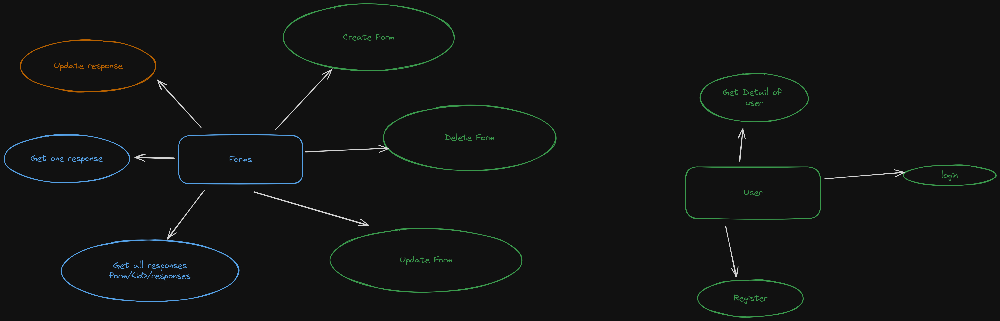

# FormSmith

It is a Dynamic Form Builder. Here you can create forms 


## How to install

1. First make an virtual enviroment
```
python -m venv venv
```
2. Install Python Packages
```
pip install requirement.txt
```
3. Start Server
```
uvicorn app.main:app --reload
```
## Roadmap
### Features
It would have the following features:

1. User login and registration.
1. Creating of Form
1. Updating of Form
1. Deleting of Form
1. 

---
